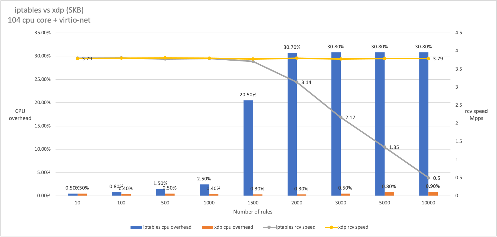
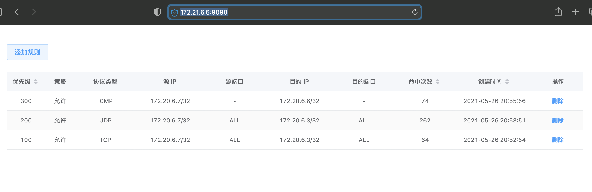

# XDP ACL

Refactor the eBPF C code and Go code of
[xdp_acl](https://github.com/glenn-wang/xdp_acl).

## Updated

1. Use CO-RE to enable XDP log with `--debug` dynamically.
2. Use specified BTF file with `--kernel-btf`.
3. Upgrade to dynamic bitmap size by rules number.
4. Upgrade bpf map of rule action to percpu-array map by replacing percpu-hash map.
5. Update ACL rules without detaching/attaching XDP.

## P.S.

The original reference is [eBPF / XDP based firewall and packet
filtering](http://vger.kernel.org/lpc_net2018_talks/ebpf-firewall-paper-LPC.pdf).

From the reference, the advice is really important to deploy XDP ACL.

```txt
We do not write or update these maps once the program is loaded to avoid any lock
contentions. Instead, for any change in configuration, we create a new program with
new maps and modify the XDP program in the program array.
```

---

#### Inspired by [this paper](https://blog.csdn.net/ByteDanceTech/article/details/106632252)


#### Benchmarks

Performance comparison test of dropping 64 byte syn packet


#### Notice
* Linux kernel required: v4.15 or later
* [How to upgrade kernel quickly ?](./docs/environment/upgrade_kernel.md)

#### Docs
* [Inner web server RESTful API](./docs/restful-api.md)

#### Environment
* [Build development environment basied on VMs](./docs/environment/build_on_VMs) (Recommended)
* [Build development environment basied on Docker image](./docs/environment/build_on_docker)
* [Build development environment basied on Host](./docs/environment/build_on_host)

#### Get Started

Download directly from release tab or compile by yourself.

```
# Compile
$ make

# Get help
$ ./xdp_acl -h

# Start (Inner web server will default listen on 0.0.0.0:9090).
$ ./xdp_acl -D eth1 -S
```

#### Web console



